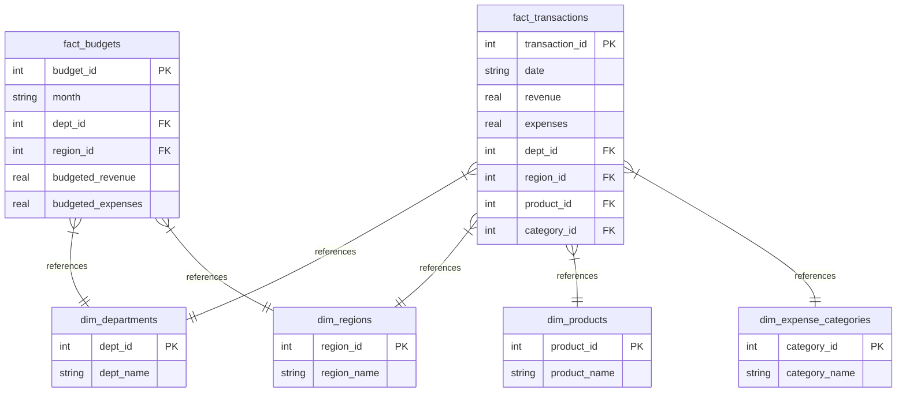

# FinSight — Corporate Financial Performance & Profitability Analytics

An end-to-end financial data engineering and business intelligence platform designed to ingest daily corporate transactions, audit data quality, reconcile monthly budgets, and analyze profitability. FinSight bridges raw data engineering (SQL star schemas, Python ETL) with visual storytelling (multi-page Streamlit dashboards, Plotly charts) and advanced financial modeling (custom-formatted Excel workbooks built programmatically).

👉 **[Live Web Application Link](https://financial-performance-analytics.streamlit.app/)**

---

## 🚀 Key Features

1. **Interactive Multi-Page BI Dashboard:**
   - **Executive Summary:** Core financial KPIs (Total Revenue, Operating Expenses, Net Operating Profit, Profit Margin %, ROI %) and trend lines (MoM growth, running totals).
   - **Profitability & Budgets:** Granular breakdowns by region and product segment (identifying high-performing lines) and a department budget-to-actual variance matrix.
   - **Ingest Transactions:** Drag-and-drop CSV/Excel portal for daily transactions uploads.
   - **Audit Trail:** logs of files processed and database-wide health diagnostics.

2. **Fuzzy Column Ingestion & Standardisation:**
   - Normalizes incoming column headers dynamically (e.g. mapping `spending`, `outflow`, or `costs` automatically to `expenses`).
   - Automatically cleans currency formatting, strips commas/symbols, and handles accounting negative brackets `(500.00)` -> `-500.00`.

3. **9-Point Data Quality Audit Gate:**
   - Evaluates each batch:
     - **Critical:** Missing dates.
     - **Warning:** Future dates, negative revenue/expense inputs, zero amounts, blank dimension values.
     - **Info:** Large transaction spikes (Revenue > $50K, Expense > $25K), duplicate rows.
   - Automatically computes a **Batch Health Score**. Batches with score `< 50%` are automatically rejected and rolled back to preserve database integrity.

4. **Programmatic Excel Workbook Compiler (`openpyxl`):**
   - Automatically compiles and refines a beautifully styled Excel workbook (`financial_analysis.xlsx`) after every successful data ingestion.
   - **Native Excel Formulas:** Writes actual uppercase formulas (e.g., `=SUM(...)`, `=IF(...)`, `=AVERAGE(...)`) into cells so that the spreadsheet behaves dynamically for users rather than displaying flat, hardcoded values.
   - Designed with a professional corporate theme (Segoe UI, navy fills, double accounting underlines, auto-fitting column widths).

5. **Advanced SQL Analytics Engine:**
   - Operates on a structured SQLite **Star Schema** utilizing Common Table Expressions (CTEs), Joins, and Window Functions (`LAG` for MoM growth, `SUM() OVER` for running totals).

---

## 📊 Database Architecture (Star Schema)

The database design normalizes daily transaction records and monthly budgets into a high-performance relational structure:



---

## 💡 Advanced SQL Query Showcases

### 1. Monthly Performance, Growth & Running Totals (CTEs & Window Functions)
Calculates monthly revenue, expenses, net profit, running revenue total, and Month-over-Month growth rate:

```sql
WITH MonthlyAggs AS (
    SELECT 
        strftime('%Y-%m', date) as month,
        SUM(revenue) as revenue,
        SUM(expenses) as expenses,
        SUM(revenue) - SUM(expenses) as net_profit
    FROM fact_transactions
    GROUP BY month
),
MonthlyGrowth AS (
    SELECT 
        month,
        revenue,
        expenses,
        net_profit,
        LAG(revenue) OVER (ORDER BY month) as prev_month_revenue,
        SUM(revenue) OVER (ORDER BY month ROWS UNBOUNDED PRECEDING) as running_total_revenue
    FROM MonthlyAggs
)
SELECT 
    month,
    ROUND(revenue, 2) as revenue,
    ROUND(expenses, 2) as expenses,
    ROUND(net_profit, 2) as net_profit,
    ROUND(running_total_revenue, 2) as running_total_revenue,
    ROUND(
        CASE 
            WHEN prev_month_revenue IS NULL THEN 0.0 
            ELSE ((revenue - prev_month_revenue) / prev_month_revenue) * 100.0 
        END, 
        2
    ) as rev_growth_pct
FROM MonthlyGrowth
ORDER BY month;
```

### 2. Departmental Budget vs Actual Variance (CTEs & Joins)
Reconciles actual daily transactions against monthly budget targets per department:

```sql
WITH Actuals AS (
    SELECT 
        dept_id,
        SUM(revenue) as actual_revenue,
        SUM(expenses) as actual_expenses
    FROM fact_transactions
    GROUP BY dept_id
),
Budgets AS (
    SELECT 
        dept_id,
        SUM(budgeted_revenue) as budget_revenue,
        SUM(budgeted_expenses) as budget_expenses
    FROM fact_budgets
    GROUP BY dept_id
)
SELECT 
    d.dept_name as department,
    ROUND(a.actual_revenue, 2) as actual_revenue,
    ROUND(b.budget_revenue, 2) as budget_revenue,
    ROUND(a.actual_revenue - b.budget_revenue, 2) as revenue_variance,
    ROUND(a.actual_expenses, 2) as actual_expenses,
    ROUND(b.budget_expenses, 2) as budget_expenses,
    ROUND(b.budget_expenses - a.actual_expenses, 2) as expense_variance
FROM Actuals a
JOIN Budgets b ON a.dept_id = b.dept_id
JOIN dim_departments d ON a.dept_id = d.dept_id
ORDER BY actual_revenue DESC;
```

---

## 🛠️ How to Run Locally

### 1. Install Dependencies
```bash
pip install -r requirements.txt
```

### 2. Generate Data & Seed Database
Initialize the database tables and load the initial transactions:
```bash
python generate_data.py
python src/db_init.py
```

### 3. Generate Styled Excel Model
```bash
python src/excel_generator.py
```

### 4. Launch Dashboard
```bash
streamlit run src/app.py
```

---

## 📬 Contact & Connections

- **Author:** Monisa L.
- **Email:** [monisa.asi@gmail.com](mailto:monisa.asi@gmail.com)
- **LinkedIn:** [linkedin.com/in/monisa-l-333546366](https://www.linkedin.com/in/monisa-l-333546366)
- **GitHub Profile:** [github.com/Monisa-Analyst](https://github.com/Monisa-Analyst)
